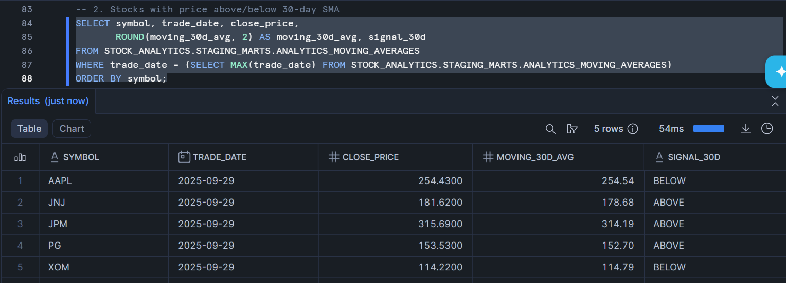
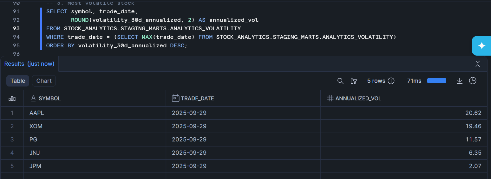
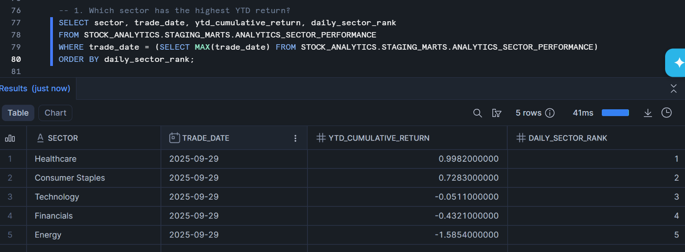
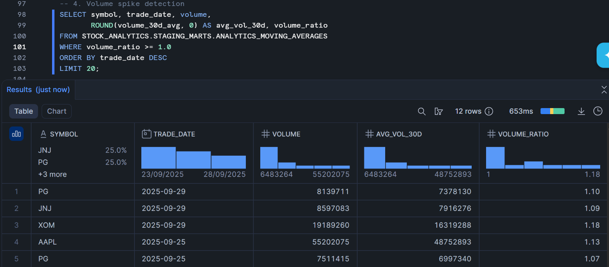

# Stock Market Analytics Pipeline

An end-to-end ELT data pipeline that ingests daily stock market data from Alpha Vantage, loads it into Snowflake, transforms it with dbt, and orchestrates everything with Apache Airflow.

**Built to demonstrate:** API ingestion, incremental loading, dimensional modeling, data quality testing, and production-grade orchestration.

---

## Architecture

```
┌──────────────────┐     ┌──────────────────┐     ┌──────────────────────────────┐
│  Alpha Vantage   │     │     Docker        │     │         Snowflake            │
│   REST API       │────▶│  Python Ingestor  │────▶│                              │
│  (Daily OHLCV)   │     │                   │     │  RAW ──▶ STAGING ──▶ MARTS   │
└──────────────────┘     └──────────────────┘     │        (dbt models)          │
                                                   └──────────────────────────────┘
                          ┌──────────────────┐
                          │  Apache Airflow   │
                          │  (Orchestration)  │
                          │  Runs daily 7PM   │
                          └──────────────────┘
```

## Tech Stack

| Tool | Purpose |
|------|---------|
| **Python** | API extraction & loading |
| **Docker & Docker Compose** | Containerized services |
| **Snowflake** | Cloud data warehouse |
| **dbt** | Data transformation & testing |
| **Apache Airflow** | Workflow orchestration |

## Data Model

### Dimensional Model (Star Schema)

```
            ┌──────────────┐
            │  dim_company  │
            │──────────────│
            │ company_key   │
            │ symbol        │
            │ sector        │
            │ sub_industry  │
            └──────┬───────┘
                   │
┌──────────┐       │       ┌──────────────────────────┐
│ dim_date │───────┼──────▶│   fact_daily_prices       │
│──────────│       │       │──────────────────────────│
│ date_key │       │       │ open/high/low/close_price │
│ year     │       │       │ volume                    │
│ quarter  │       │       │ daily_return_pct           │
│ month    │       │       │ daily_price_change         │
└──────────┘       │       └──────────────────────────┘
                   │
            ┌──────┴────────────────┐
            │   Analytics Models     │
            │───────────────────────│
            │ analytics_moving_avg   │
            │ analytics_volatility   │
            │ analytics_sector_perf  │
            └───────────────────────┘
```

### Pipeline Layers

| Layer | Schema | Description |
|-------|--------|-------------|
| **Raw** | `RAW` | Immutable JSON landing zone from Alpha Vantage API |
| **Staging** | `STAGING` | Flattened, typed, deduplicated daily price records |
| **Marts** | `MARTS` | Dimensional model + analytics views |

## Analytics & Business Questions

### 1. Moving Averages (Technical Analysis)
30-day simple moving averages with buy/sell signals when price crosses the 30-day SMA.



### 2. Rolling Volatility
30-day annualized volatility at both stock and sector level, with high-volatility flags when a stock exceeds 1.5x its sector's volatility.



### 3. Sector Performance & Rotation
Daily sector rankings, YTD cumulative returns, and sector rotation analysis across Technology, Financials, Healthcare, Energy, and Consumer Staples.



### 4. Volume Spike Detection
Identifies days where trading volume exceeded 1x the 30-day average — often signals major news or institutional activity.



## Stocks Tracked

| Symbol | Company | Sector |
|--------|---------|--------|
| AAPL | Apple Inc. | Technology |
| JPM | JPMorgan Chase & Co. | Financials |
| JNJ | Johnson & Johnson | Healthcare |
| XOM | ExxonMobil Corp. | Energy |
| PG | Procter & Gamble Co. | Consumer Staples |

Designed to scale — add stocks by updating `config.py` and `seed_companies.csv` (up to 25 on free API tier).

## Airflow DAG

The pipeline runs automatically on weekdays at 7:00 PM ET (after market close):

```
ingest_stock_data → dbt_run → dbt_test → dbt_docs_generate
```


## dbt Lineage


## Project Structure

```
stock-market-pipeline/
├── docker-compose.yml
├── .env
├── .gitignore
│
├── airflow/
│   ├── Dockerfile
│   └── dags/
│       └── stock_pipeline_dag.py
│
├── ingest/
│   ├── Dockerfile
│   ├── requirements.txt
│   ├── ingest.py
│   └── config.py
│
└── dbt_project/
    ├── dbt_project.yml
    ├── profiles.yml
    ├── packages.yml
    ├── models/
    │   ├── staging/
    │   │   ├── _staging__sources.yml
    │   │   └── stg_daily_prices.sql
    │   └── marts/
    │       ├── _marts__models.yml
    │       ├── dim_company.sql
    │       ├── dim_date.sql
    │       ├── fact_daily_prices.sql
    │       ├── analytics_moving_averages.sql
    │       ├── analytics_volatility.sql
    │       └── analytics_sector_performance.sql
    └── seeds/
        └── seed_companies.csv
```

## Setup & Installation

### Prerequisites
- Docker Desktop
- Snowflake account (free trial works)
- Alpha Vantage API key ([get one free](https://www.alphavantage.co/support/#api-key))

### 1. Clone & Configure

```bash
git clone https://github.com/SakethreddyPatla/stock-market-pipeline.git
cd stock-market-pipeline
```

Create a `.env` file:

```env
ALPHA_VANTAGE_API_KEY=your_key
SNOWFLAKE_ACCOUNT=your_account
SNOWFLAKE_USER=your_user
SNOWFLAKE_PASSWORD=your_password
SNOWFLAKE_WAREHOUSE=STOCK_WH
SNOWFLAKE_DATABASE=STOCK_ANALYTICS
SNOWFLAKE_ROLE=ACCOUNTADMIN
AIRFLOW_UID=50000
```

### 2. Set Up Snowflake

Run the SQL in `setup.sql` in a Snowflake worksheet to create the warehouse, database, schemas, and raw landing table.

### 3. Build & Run

```bash
# Build all containers
docker compose build

# Initialize Airflow
docker compose run airflow-init

# Start everything
docker compose up -d

# Run initial data ingestion
docker compose run ingest

# Run dbt transformations
cd dbt_project
dbt deps
dbt seed
dbt run
dbt test
```

### 4. Access Airflow UI

Open [http://localhost:8080](http://localhost:8080) — login with `admin` / `admin`.

## Key Design Decisions

- **Raw JSON storage**: API responses stored as Snowflake VARIANT for schema flexibility — if Alpha Vantage adds fields, nothing breaks.
- **Incremental fact table**: `fact_daily_prices` uses dbt's incremental materialization with merge strategy — only new records are processed on each run.
- **Deduplication in staging**: ROW_NUMBER window function handles duplicate ingestions gracefully.
- **Annualized volatility**: Uses √252 multiplier (trading days per year) for industry-standard volatility calculation.
- **Sector-level analytics**: Enables cross-sector comparison and rotation analysis with a single query.

## Data Quality

12 dbt tests validate the pipeline:

- **Uniqueness**: Surrogate keys on all dimensions and facts
- **Not null**: Critical columns (price_id, close_price, company_key, date_key)
- **Referential integrity**: Foreign keys between fact and dimension tables
- **Source freshness**: Raw data symbol validation

## What I'd Add With More Time

- **Streamlit dashboard** for interactive visualization
- **Great Expectations** for advanced data quality checks
- **CI/CD** with GitHub Actions to run dbt tests on PRs
- **Slack alerts** on pipeline failure via Airflow callbacks
- **More stocks** with sector-weighted portfolio analysis
- **News sentiment** from a second API source for correlation analysis
